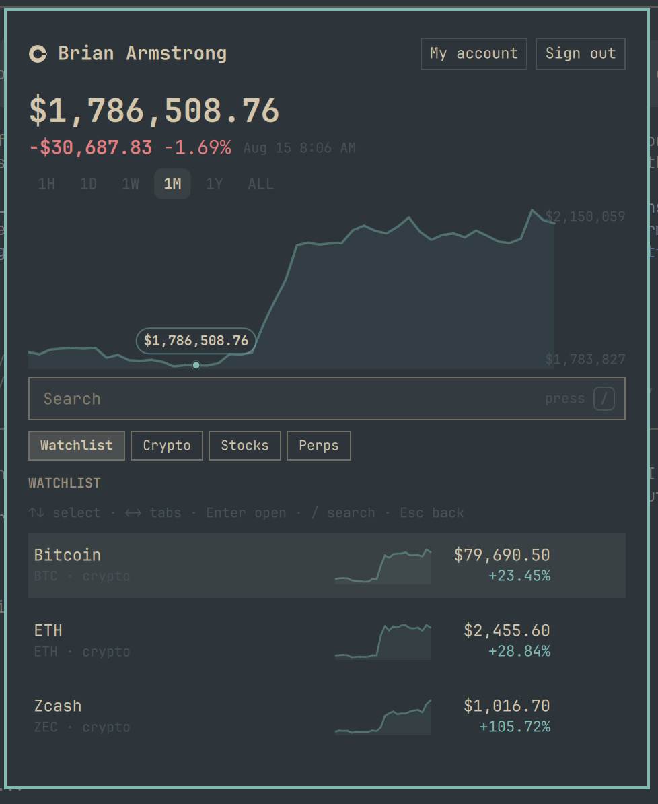
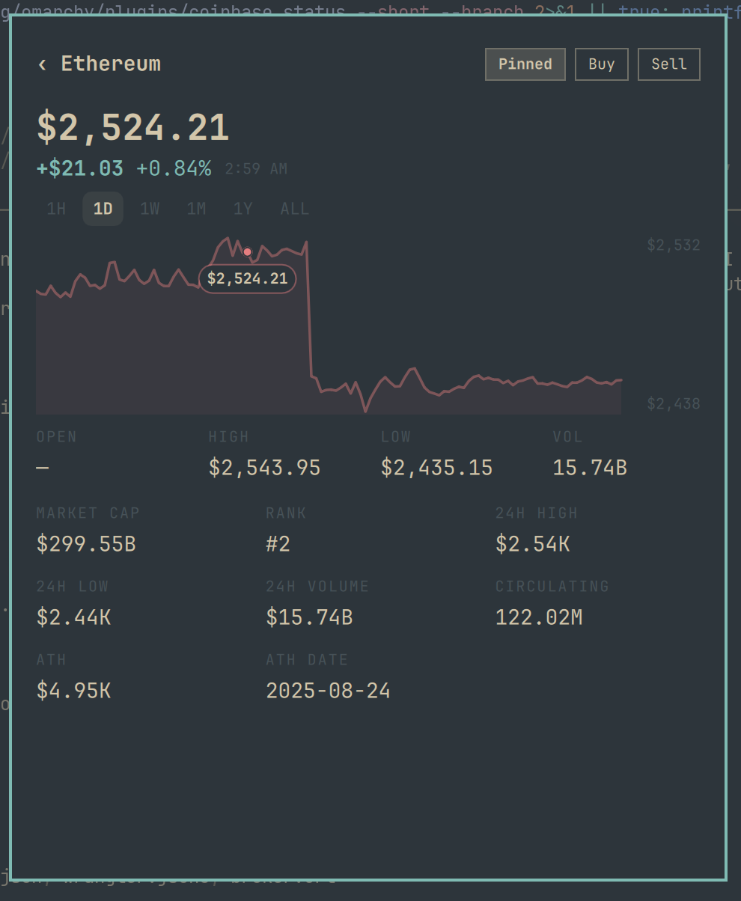

# Coinbase for Omarchy

An unofficial Coinbase portfolio widget and dashboard for Omarchy. Signed out,
the bar shows a configurable market ticker. Signed in, it shows your Coinbase
portfolio balance and period change.

The panel includes:

- Portfolio, crypto, stock, perpetual, and Coinbase watchlist views
- Synchronized 1H, 1D, 1W, 1M, 1Y, and all-time charts and sparklines
- Asset detail pages, search, market statistics, and links to Coinbase.com
- Full keyboard navigation: arrows move through rows and tabs, Enter opens an
  asset, Escape goes back or closes, and `/` focuses search
- Three bar display modes; right-click cycles full, balance-only, and icon-only
- A read-only Coinbase watchlist refresh while the panel is open

This project is not affiliated with or endorsed by Coinbase. Coinbase and its
logo are trademarks of their respective owner.

## Screenshots

<p align="center">
  
  
</p>

## Install

Requires Omarchy with `omarchy-shell`, Python 3, and network access. It has no
third-party Python or JavaScript runtime dependencies and needs no elevated
privileges.

The Coinbase submission has passed the marketplace's automated compatibility
and security-baseline checks and is awaiting maintainer listing approval. Once
it is published on [Omarchy Plugin Marketplace](https://omarchyplugins.com/),
its install button will copy this same command:

```bash
omarchy plugin add https://github.com/barmstrong/omarchy-coinbase.git --enable
```

The command clones the current public repository, validates it locally, and
then installs and enables the widget. Until the listing is approved, run it
directly in a terminal.

Click the bar widget, then **Sign in with Coinbase**. The repository includes a
hosted OAuth broker URL, so installers do not need a Coinbase client secret.

## Remove

Use **Log out** in the panel first. This asks Coinbase to revoke the active
access token and then removes the local token file. Remove the plugin with:

```bash
omarchy plugin remove coinbase
```

Omarchy may retain non-secret preferences and market-data caches under
`~/.local/state/omarchy/coinbase/` after removal. To erase those files too:

```bash
rm -r -- ~/.local/state/omarchy/coinbase
```

## Security and privacy

Plugins execute inside `omarchy-shell` without a sandbox. Review third-party
plugin source before enabling it.

Coinbase authorization requests only these scopes:

- `wallet:user:read`
- `wallet:accounts:read`
- `offline_access` (for refresh tokens)

The plugin has no code path that places trades or moves funds. Buy, sell,
deposit, withdrawal, send, and receive controls only open an HTTPS page on
Coinbase.com in your browser. Browser launches are restricted to Coinbase HTTPS
hosts.

Access and refresh tokens are stored locally at
`~/.local/state/omarchy/coinbase/tokens.json` with mode `0600`; the containing
directory is mode `0700`. They are never placed in QML, command-line arguments,
or this repository. Portfolio snapshots and caches live in the same private
directory.

The default hosted Cloudflare Worker in `broker/` holds the OAuth application's
client secret. During sign-in it temporarily holds an authorization session and
the returned tokens for up to ten minutes so the plugin can collect them using a
random 256-bit session ID that is separate from the browser-visible OAuth state.
Refresh and revocation requests also pass through the broker because Coinbase
requires the application's client secret. The Worker
source is included for review and can be self-hosted. Native Cloudflare rate
limits protect its session-creation and token endpoints from basic abuse.

The plugin contacts these services:

- `api.coinbase.com` and `login.coinbase.com` for account, watchlist, market,
  OAuth, refresh, and revocation requests
- Yahoo Finance and CoinGecko for public quotes, search results, metadata, and
  chart fallbacks
- the SEC data API for public US equity share-count fallbacks

Requests to public market-data providers can reveal your IP address and the
asset symbols needed by the current view. Coinbase bearer credentials are sent
only to `api.coinbase.com`; authenticated redirects cannot cross origins.

If you used a development build before v1.0.0, log out and sign in again to
replace the older, broader OAuth grant with the scopes above.

## Self-host the OAuth broker

Self-hosting requires a Coinbase OAuth application and a Cloudflare account.
Create an OAuth app in the [CDP portal](https://portal.cdp.coinbase.com/oauth),
allow the three scopes listed above, then run:

```bash
npx --yes wrangler@4.129.0 login
./broker/deploy.sh
```

The script deploys the Worker, writes its origin to `broker.url`, and prompts
for `COINBASE_CLIENT_ID` and `COINBASE_CLIENT_SECRET` as encrypted Worker
secrets. Register the exact HTTPS callback it prints:

```text
https://your-worker-host/oauth/callback
```

For a custom deployment, replace `broker.url` with your HTTPS Worker origin.

## Local development fallback

If `broker.url` is absent, the helper accepts a personal OAuth app using the
loopback callback `http://127.0.0.1:8765/callback`:

```bash
bin/coinbase setup YOUR_CLIENT_ID YOUR_CLIENT_SECRET
bin/coinbase login
```

The secret is stored locally with mode `0600`. The panel passes it to the helper
over standard input so it does not appear in the process list.

Useful development commands:

```bash
omarchy plugin validate .
node broker/test.mjs
python3 -m unittest discover -s tests -v
bin/coinbase status
bin/coinbase snapshot --period day
bin/coinbase search eth
bin/coinbase ticker ETH-USD
bin/coinbase logout
```

The Watchlist tab mirrors the Coinbase account and refreshes when the panel
opens, then every 60 seconds while it remains open. Manage watchlist membership
through **My Account** on Coinbase.com.
