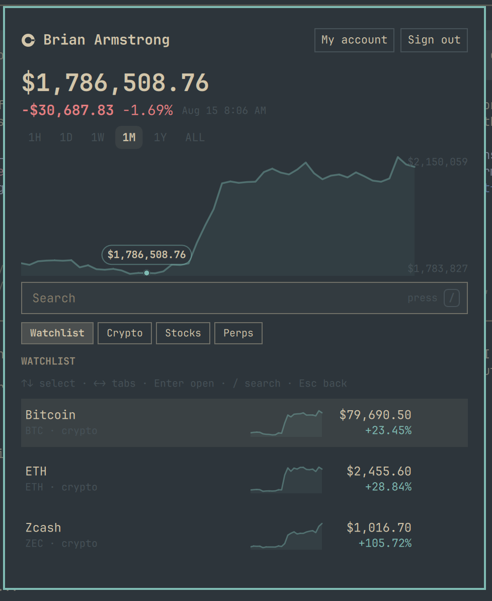
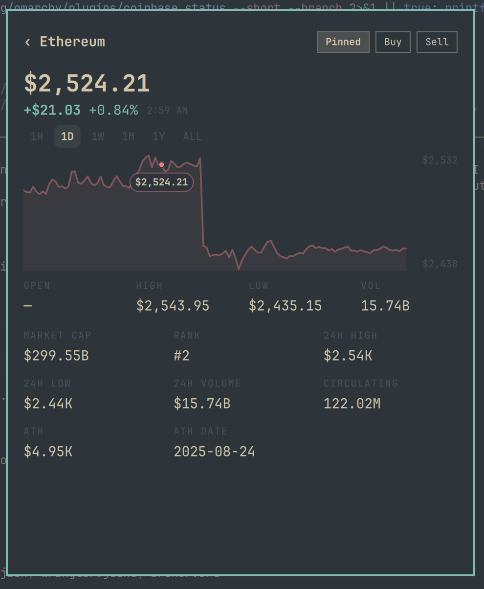

# Coinbase for Omarchy

An unofficial Coinbase portfolio widget and dashboard for Omarchy. Signed out,
the bar shows a configurable market ticker. Signed in, it shows your Coinbase
portfolio balance and period change.

The panel includes:

- Portfolio and Coinbase watchlist views plus 24-hour-volume-ranked all, spot
  crypto, stock, commodity, and index markets
- Synchronized 1H, 1D, 1W, 1M, 1Y, and all-time charts and sparklines
- Asset detail pages, search, market statistics, and links to Coinbase.com
- Full keyboard navigation: arrows move through rows and tabs, Enter opens an
  asset, Escape goes back or closes, `/` focuses search, and `P` pins the
  current asset while signed out
- Three bar display modes; right-click cycles full, balance-only, and icon-only
- Simple Retail watchlist refresh, with Add/Remove controls on asset detail pages
- Watchlist ordering with six-dot drag handles or Alt+Up/Down on the selected row;
  moves appear immediately and roll back on failure
- Cache-first rendering that keeps the last complete view visible while market
  and portfolio data update in the background, including when offline
- Instant repeat asset details from an owner-only local cache; stale charts and
  statistics render immediately while public market data refreshes in the background

Pre-IPO perpetuals are currently excluded from the interface, including search
and cached watchlist rows. This is a manual filter, not automatic account/region
eligibility detection, and does not remove anything from your Coinbase watchlist.

This project is not affiliated with or endorsed by Coinbase. Coinbase and its
logo are trademarks of their respective owner.

## Screenshots

<p align="center">
  
  
</p>

## Install

Requires Omarchy with `omarchy-shell`, Python 3, and network access. The widget
has no third-party Python dependencies. On first enable, a setup prompt offers
the optional official Coinbase CLI and lets you choose which agents receive its skill.
Installation runs as your user and needs no elevated privileges.

The [marketplace submission](https://github.com/omacom/omarchy-plugin-marketplace/issues/7520)
is awaiting maintainer approval. On October 1, the reviewer
[withdrew the earlier broker and read-only requirements](https://github.com/omacom/omarchy-plugin-marketplace/issues/7520#issuecomment-5924487958).
Version 1.0.29 addresses the subsequent
[agent opt-in request](https://github.com/omacom/omarchy-plugin-marketplace/issues/7520#issuecomment-5931520767)
with explicit CLI confirmation and per-agent selection; the new commit needs review.
Automated checks alone do not approve a listing. Install the public repository directly:

```bash
omarchy plugin add https://github.com/barmstrong/omarchy-coinbase.git --enable
```

The command clones the current public repository, validates it locally, and
then installs and enables the widget. Omarchy has no plugin install hook, so
the optional setup prompt opens in a terminal on first enable. Installing
without `--enable` defers that prompt until the plugin is enabled.

Click the bar widget, then **Sign in with Coinbase**. The repository includes a
hosted OAuth broker URL, so installers do not need a Coinbase client secret.

## CLI and agent integration

First enable opens a one-time setup prompt:

1. **Install Coinbase CLI?** defaults to **Yes**, but requires confirmation.
   Choose **No** to use only the widget. No downloads happen before confirmation.
2. Select which agents receive the Coinbase skill. **Nothing is preselected**;
   use the displayed toggle key to check an agent and Enter to confirm. Leave everything
   unchecked to install only the CLI.

Closing or canceling setup grants no new permissions. The prompt does not
repeatedly reopen; rerun `setup-agents configure` when ready. Existing CLI
installations do not imply consent to register agent instructions. Upgrading
from pre-1.0.29 removes legacy plugin-owned skill links and offers the same
choice, while preserving the existing CLI until a choice is made. A prior
explicit opt-out remains respected.

After confirmation, setup installs the official `@coinbase/coinbase-cli` version 0.0.10 from npm using
the committed lockfile and integrity hashes, with lifecycle scripts disabled.
The runtime lives in `~/.local/share/omarchy/coinbase-cli/`; its launcher is
`~/.local/bin/coinbase`, already on PATH in Omarchy. The widget continues using
its own private `bin/coinbase` helper.

The official CLI needs Node.js 22+ and npm. Setup uses a compatible installed
runtime or installs Node 22 through Omarchy's `mise`, without changing the
user's global Node selection. Runtime downloads use mise's configured backend;
CLI packages use npm's configured registry/cache. Linux credential storage
uses `secret-tool` (Arch's `libsecret` package). Credentials are not configured,
copied, or read by setup; the CLI's authentication is separate from the widget's
OAuth login. See the [official CLI guide](https://docs.cdp.coinbase.com/coinbase-cli/skill.md).

A single bundled `skills/coinbase-cli` directory is linked only into the
selected user skill directories. Choices include Claude, Codex, Cursor, Gemini,
Copilot, Pi, OpenClaw, OpenCode, Crush, Grok, and Hermes, with existing Hermes
profiles offered individually. No link is created in the shared `~/.agents/skills`
directory. Directory mappings follow the
[Skills project's agent registry](https://github.com/vercel-labs/skills/blob/main/src/agents.ts)
and Omarchy's existing skill locations. Supported configuration-root environment
variables are honored when choosing agents. The exact selected directories are
saved; a later environment change cannot silently redirect registration.
You may explicitly select an agent before installing it. Future agents and
profiles are never added automatically; rerun configuration to select them.

While the plugin is enabled, setup reconciles the saved choices every five
minutes, repairing missing links for selected agents after reinstallation.
No selection means no CLI download or new agent directories/links. It performs
no npm download once the pinned runtime is ready.
Existing commands and same-name user skills are preserved. A conflicting
`coinbase` command blocks setup and is reported in status, rather than replaced.
Open a new agent session (or reload skills) after installation.

```bash
coinbase --version
coinbase --help
python3 ~/.config/omarchy/plugins/coinbase/bin/setup-agents status
python3 ~/.config/omarchy/plugins/coinbase/bin/setup-agents configure
python3 ~/.config/omarchy/plugins/coinbase/bin/setup-agents ensure
```

For explicit noninteractive setup, `enable` installs only the CLI by default.
Add each intended agent by name (e.g. `--agent codex --agent claude`).
`ensure` only repairs an existing selection; it cannot opt in.

```bash
python3 ~/.config/omarchy/plugins/coinbase/bin/setup-agents enable
python3 ~/.config/omarchy/plugins/coinbase/bin/setup-agents enable --agent codex --agent claude
```

Choices are stored in `~/.local/state/omarchy/coinbase-agents/selection.json`.
Rerunning configuration replaces the selection and removes deselected managed
links. Choosing **No** also removes any plugin-managed CLI installation.

Failures are recorded in `~/.local/state/omarchy/coinbase-agents/status.json`
and retried at the next five-minute interval. To opt out, remove the managed
CLI runtime, launcher and skill links, and prevent automatic reinstallation:

```bash
python3 ~/.config/omarchy/plugins/coinbase/bin/setup-agents remove
# Choose what to opt back into:
python3 ~/.config/omarchy/plugins/coinbase/bin/setup-agents configure
```

## Remove

Use **Log out** in the panel first. This asks Coinbase to revoke the active
access token and then removes the local token file. Remove the plugin with:

```bash
python3 ~/.config/omarchy/plugins/coinbase/bin/setup-agents uninstall
```

This invokes Omarchy's normal removal confirmation, then removes the managed
CLI runtime, launcher and agent skill links. Add `--yes` for noninteractive
removal. Canceling confirmation leaves the CLI and links intact. Independently
installed commands, user skills, the shared Node.js runtime and CLI credentials
are preserved. A later plugin reinstall offers the setup prompt again.

Plain `omarchy plugin remove coinbase` does **not** clean up the CLI or skill
links: Omarchy does not currently invoke uninstall hooks. Use the combined
command above, or run `setup-agents remove` before native plugin removal.
The separate `remove` action persists an explicit opt-out across reinstalls;
run `setup-agents configure` to change it.

Omarchy may retain non-secret preferences and market-data caches under
`~/.local/state/omarchy/coinbase/` after removal. To erase those files too:

```bash
rm -r -- ~/.local/state/omarchy/coinbase
```

## Security and privacy

Plugins execute inside `omarchy-shell` without a sandbox. Review third-party
plugin source before enabling it.

The default authorization scopes in this source tree are:

- `wallet:user:read`
- `wallet:accounts:read`
- `wallet:watchlist:read`
- `wallet:watchlist:update`
- `offline_access` (for refresh tokens)

Watchlist read and update permissions are independent. Older grants remain
usable for portfolio viewing; sign out and back in to enable watchlist access.
The detail-page toggle requires read access to show current membership and
update access to edit it. A hosted broker's requested scopes may differ from
the source defaults; inspect the Coinbase consent screen.

Drag the six-dot handle on a watchlist row to move it. The cursor changes to a
grab hand, a marker shows the drop position, and dragging near the list edges
scrolls the list. Release to save, or press Escape to cancel. Alt+Up and Alt+Down
also move the selected row.

Reordering uses the same update scope via the documented
[Simple Retail reorder endpoint](https://docs.cdp.coinbase.com/coinbase-app/track-apis/watchlist#reorder-an-item).
Each move uses stored canonical identifiers and one neighboring visible item
as its anchor. Hidden items are not deleted or sent as a replacement list;
other items retain their relative order. Controls are unavailable in search,
other tabs, or while a move is pending. The plugin rereads after a move and
never automatically retries an uncertain write.

The widget has no code path that places trades or moves funds. Buy, sell,
deposit, withdrawal, send, and receive controls only open an HTTPS page on
Coinbase.com in your browser. Browser launches are restricted to Coinbase HTTPS
hosts.

Access and refresh tokens are stored locally at
`~/.local/state/omarchy/coinbase/tokens.json` with mode `0600`; the containing
directory is mode `0700`. They are never placed in QML, command-line arguments,
or this repository. Portfolio snapshots, account-derived watchlist data, and
market caches in that directory are also written with mode `0600`. Logout
deletes the token and account-derived watchlist cache before publishing a
signed-out snapshot. A separate public-market snapshot is retained so logout
and offline refreshes can switch views without an empty intermediate screen.

The default hosted Cloudflare Worker in `broker/` holds the OAuth application's
client secret. Each sign-in uses one isolated, strongly consistent Durable
Object containing only its PKCE/session state. Returned tokens remain there for
only the moment needed for the desktop's pending poll to collect them and are
never written to Durable Object storage. A random 256-bit claim secret that is
not sent to the browser protects that handoff; a successful claim deletes the
object immediately, and a ten-minute alarm deletes abandoned session state.
There is no server-side user or token table. Refresh
and revocation requests pass through the broker because Coinbase requires the
application's client secret, but those tokens are not written to server-side
storage. The Worker source is included for review and can be self-hosted.
Cloudflare rate limits protect every OAuth endpoint: anonymous entry points are
limited per source IP, while polling and token operations also have per-session
or per-credential limits. The Worker fails closed if a required binding is
absent. The helper refuses token responses containing scopes outside the five
scopes above. The broker validates against
its configured requested scopes. Trading and transfer scopes are not accepted.

The plugin contacts these services:

- `api.coinbase.com` and `login.coinbase.com` for account, watchlist, market,
  OAuth, refresh, and revocation requests
- Yahoo Finance and CoinGecko for public quotes, search results, metadata, and
  chart fallbacks
- the SEC data API for public US equity share-count fallbacks

Requests to public market-data providers can reveal your IP address and the
asset symbols needed by the current view. Coinbase bearer credentials are sent
only to `api.coinbase.com`; authenticated redirects cannot cross origins.

If you used a development build before v1.0.0, log out and sign in again to
replace the older, broader OAuth grant with the scopes above.

## Self-host the OAuth broker

Self-hosting requires a Coinbase OAuth application and a Cloudflare account.
Create an OAuth app in the [CDP portal](https://portal.cdp.coinbase.com/oauth),
request the five scopes listed above, then run:

```bash
npx --yes wrangler@4.129.0 login
./broker/deploy.sh
```

The script deploys the Worker, writes its origin to `broker.url`, and prompts
for `COINBASE_CLIENT_ID` and `COINBASE_CLIENT_SECRET` as encrypted Worker
secrets. Register the exact HTTPS callback it prints:

```text
https://your-worker-host/oauth/callback
```

For a custom deployment, replace `broker.url` with your HTTPS Worker origin.

## Local development fallback

If `broker.url` is absent, the helper accepts a personal OAuth app using the
loopback callback `http://127.0.0.1:8765/callback`:

```bash
bin/coinbase setup YOUR_CLIENT_ID YOUR_CLIENT_SECRET
bin/coinbase login
```

The secret is stored locally with mode `0600`. The panel passes it to the helper
over standard input so it does not appear in the process list.

Useful development commands:

```bash
omarchy plugin validate .
node broker/test.mjs
node tests/model.test.js
python3 -m unittest discover -s tests -v
bash tests/refresh/run.sh # Requires a running desktop session
python3 tests/agents/run.py # Isolated headless service smoke test
python3 tests/agents/prompt.py # Real terminal prompts; package installation stubbed
bin/coinbase status
bin/coinbase snapshot --period day
bin/coinbase chart BTC-USD --period week --symbol BTC --kind crypto
bin/coinbase search eth
bin/coinbase ticker ETH-USD
bin/coinbase logout
```

The **Watchlist** tab refreshes when the panel opens, then every 60 seconds while
it remains open. It reads the Simple Retail `/v2/watchlist/items` API, requires
`wallet:watchlist:read`, and preserves the order returned by that API. Advanced
Trade `watched` flags are no longer used. Failed requests retain only a prior
Simple Retail cache; they never fall back to the Advanced Trade watchlist.
Crypto UUIDs and equity CBRNs are resolved using Coinbase asset metadata.
XRP and Zcash's canonical Base token references are mapped using the verified
network/address identities on [Coinbase's XRP page](https://www.coinbase.com/price/xrp)
and [Zcash page](https://www.coinbase.com/price/zcash).
The original token reference is retained for removal.
Stock metadata follows all catalog pages and preserves alternate USD/USDC
product IDs. Unknown equity IDs get an exact public product lookup, cached
locally; stock identities are never guessed from prices or watchlist order.
Unresolved item types (including predictions and some stock CBRNs) are skipped
in the widget and remain untouched in Coinbase.

On an asset detail page, click **Watchlist** to the left of Buy/Sell. An outlined
star means not added; a filled star means added. Clicking toggles membership,
and repeated clicks are ignored while a request is pending. The button does
not dim, change labels, or show tooltips during updates. The star toggles
immediately and reverts if the write fails. User actions wait for a busy
snapshot writer instead of being discarded by background refreshes.
Adds POST one typed identifier to `/v2/watchlist/items`; removals POST the
stored identifier to `/v2/watchlist/items/remove`. Both return `{}`; a separate
GET refreshes the list. Network failures never trigger automatic write retries.
Crypto additions resolve a unique asset UUID. Stock additions use native IDs
from Coinbase's equity catalog. Unsupported products are hidden until their
owning metadata source is supported.

Opening the panel immediately requests a fresh snapshot. While open, it polls
every 15 seconds, reusing a snapshot only if it is at most 10 seconds old.
The bar continues polling at its configured interval (60 seconds by default).
Refreshes already in progress are shared; requests do not queue or overlap.
“Updating…” appears only while a chart-period change or missing content is loading.
Network work can continue quietly for up to two
minutes before the helper is terminated. Background jobs skip an already-busy
snapshot writer and retry on the next timer tick. Refresh failures preserve the
last good balances and data timestamp, show a stale-data notice, and back off
for 30 seconds (manual refresh bypasses that backoff). Partial watchlist
failures retain cached entries for the failed categories. Candle caches are
merged and written once per helper command, rather than once per chart.
